## Summary

Decided to provide notes on some other aspects of system administration that not
everyone knows how to do. But, everyone definately can do on their Windows
workstations. I move back and forth between Linux and Windows machines
frequently with flash drives and don't always eject the drive safely. I either
use these flash drives for one off cases or as installation media for various
operating systems.

Sometimes with this constant switching back and forth. I run into situations
where the external media gets corrupted somehow. When this happens  I need to 
fix it by starting off from scratch on the external media. One method; on
Windows, I use is 
[PowerShell to wipe and reformat the volumes on the disk](/feed/notes/microsoft/basic-usb-operations-in-powershell/).
Another method is a mixture of both PowerShell and the Disk Management tool.
(Sometimes I like a visual)

Granted, I do see the need to just know how to format a hard drive using Disk
Management. So that is what this note really provides. A simple why to create a
new volume on an external hard drive. Then it will provide steps on how to
format that disk to exFAT. But, also explains the different options available
with their pros and cons.

## Opening Disk Management

First order of business is opening Disk Managment. This can be done from the
Quick Access Menu by either using the shortcut `Win+X` or by right-clicking the 
Windows or Start Menu button in the taskbar.

Once that's finished. We should see the following. We'll want to left-click on
the `Disk Management` option.

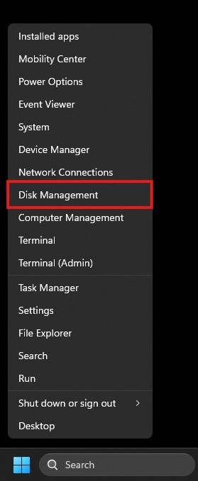

This is called `Disk Managment`. This is where we can manage hard drives,
volumes, disk partitions, etc on Windows computers. We can create new volumes,
format volumes, delete volumes, etc. from this menu. This is the gist of what we
can do with `Disk Management`. Although there are a few more things we can do.
That should sum up some of the basics.

What we'll focus on here is `Disk 1`. A flash drive I recently wiped for the
purpose of writting out these notes. As you can see this is a 32 GB removable or
flash drive media and all of the space on it is unallocated. This means the
space isn't being utilized. A volume can be created and formatted for use.

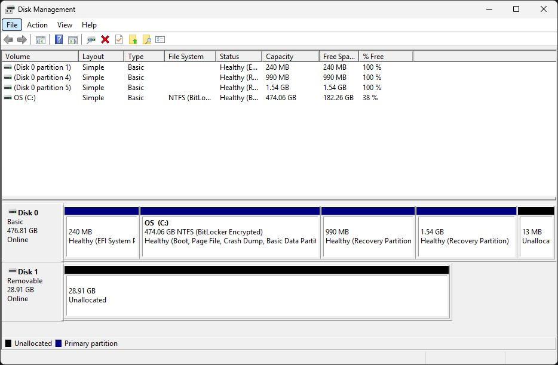

The next steps will go into creating a new volume so it can be formatted for
future use.

## Create A New Volume

Creating a new volume is pretty simple. We'll be going through the `New Simple
Volume Wizard` to complete this task. But, first we need to be able to open it
on the drive of our choosing.

In my case. I right-click `Disk 1` and then left-click `New Simple Volume...` to
open the `New Simple Volume Wizard`.

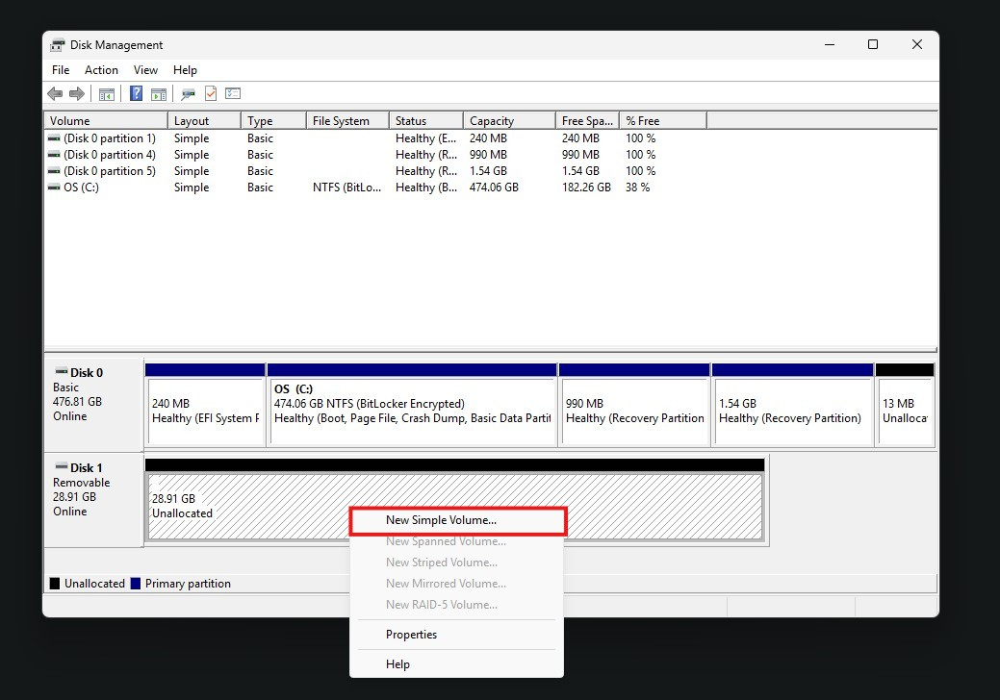

The following window should pop up showing the initial screen of the `New Simple
Volume Wizard`. To continue to the next step we'll left-click `Next`. There
shouldn't be anything actionable at this screen apart from a little reading if
you so choose.

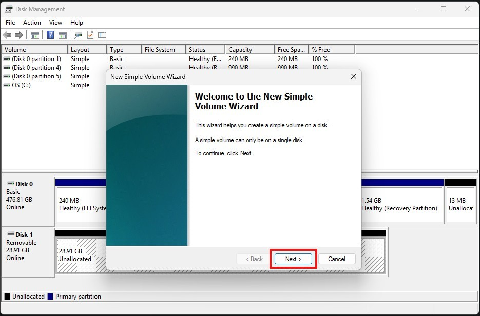

This next step is dependent on how you expect to setup this drive. You can
create multiple volumes by going through the process until the disk fills up
with volumes. Though that will require some math on your part. If you'd wish to
continue with this option and get stuck. I can answer questions by contacting me
via the [Contact](/contact) page. As a rule of thumb. Don't try to exceed the
maximum space. If you wish to only use half of your disk and expand later. Use
an online calculator or type out your desired size in the `Simple volume size in
MB` box. There are hard drive calculators that can assist with this.

Now that's out of the way. I will be using the full `29,602 MB` (29 GB) availble
because this is a flash drive meant for various needs. Once I'm satesfied with
the number. I click the `Next` button to move on.

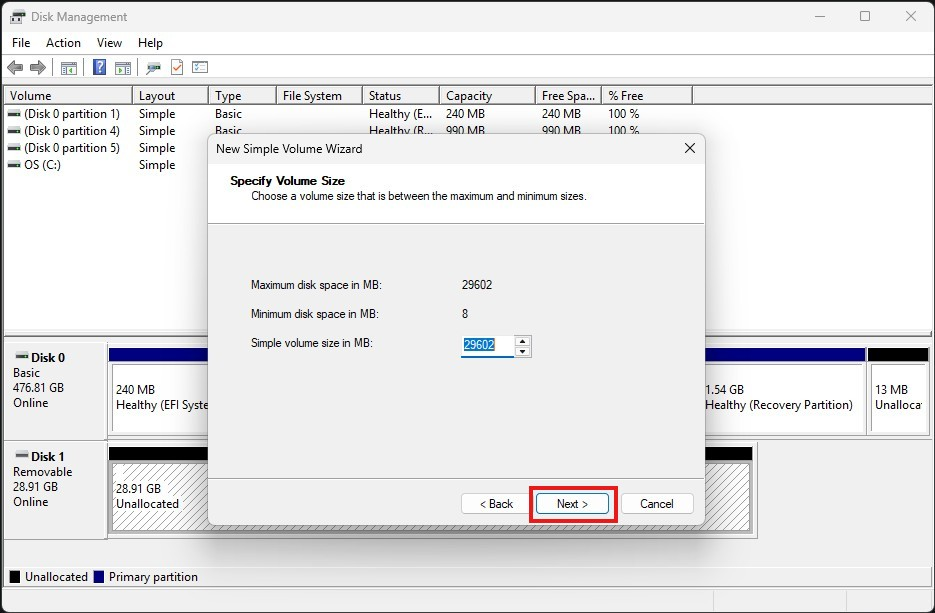

The next screen will allow me to set a drive letter. I will shy away from
formatting the disk for now because I'll get to formatting this in `exFAT` in
the next section. The `D` option was the default. I'm not worried about that
drive being taken up by another shared drive or disk. I click the `Next` button
to move on.

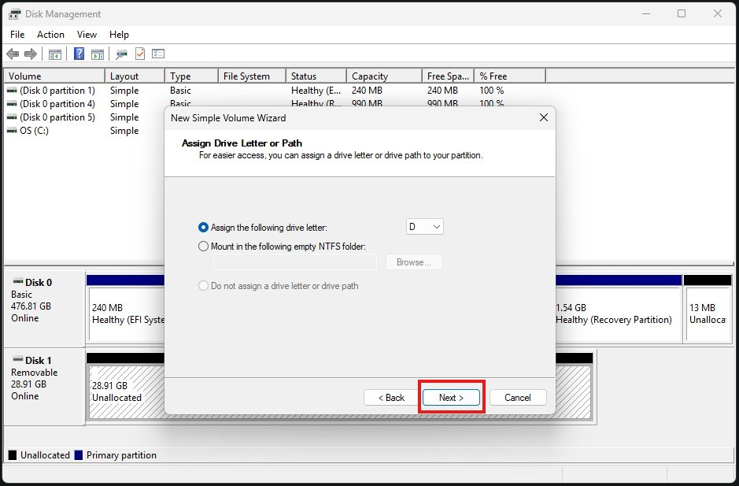

As said before. I will shy away from formatting the volume by choosing the `Do
not format this volume` option. I've found that with flash drives it doesn't
format the volume anyway. It will output in a `RAW` format when all is said and
done. I click the `Next` button to move on.

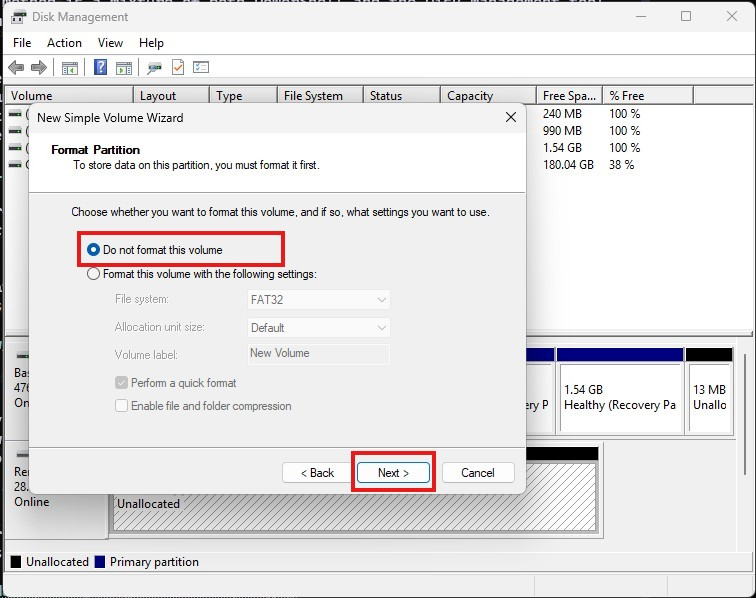

The `New Single Volume Wizard` will provide a screen showing a summary of
everything it will do to the volume on the drive. If you're satesfied with the
summary. Click `Finish`.

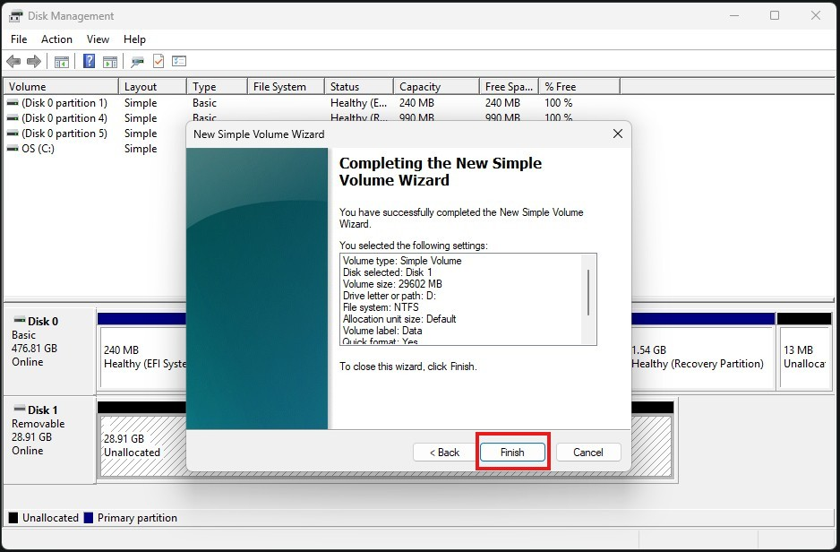

Once completed. We'll should see our new volume as a `RAW` formatted disk on
`Disk 1`.

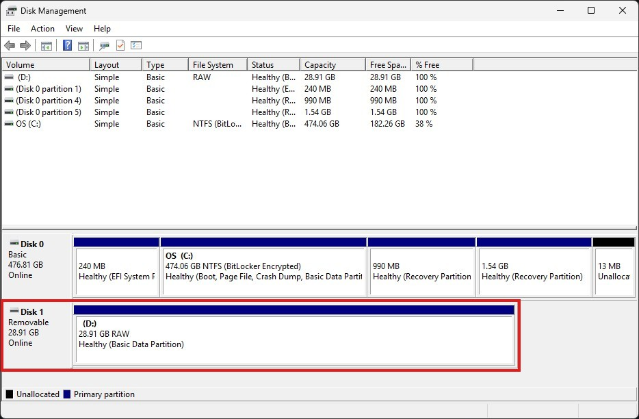

Should be able to move on to the next section of this article where we format
the newly created volume.

## Formatting The New Volume

I didn't format the drive. The exFAT option isn't available when creating a new
volume. So I created a volume without formatting the flash drive initially. I
think it's meant for formatting internal disks and not removable media anyway.

To move on and format the flash drive. I right click the volume on `Disk 1` and
then I click the `Format...` option in the list of options.

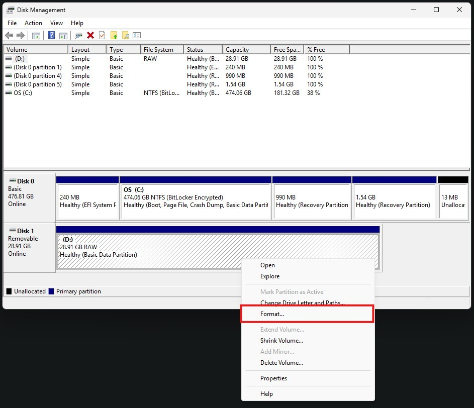

I'm going to circle back to this note a little and talk about how the different
file system options can be used. There are different use cases for these.

`NTFS` is the default file system for Windows volumes. These can be easily read 
by the Windows operating system and Windows can utilize features like Bitlocker 
to encrypt the drive. There are no practicle transfer limits and support file
sizes up to `16 exbibytes (EiB)` theoretically or `8 pebibytes (PB)` and volume 
sizes up to `8 pepbibytes (PB)`.

`FAT32` although I avoid it in most instances. There are times I don't have any
other choice. Coupled with an `MBR` partition table and `FAT32` there are some
devices (e.g. firewalls, switches, industrial sewing machines, etc) that will
only accept this format. There is a `4 gigabyte (GB)` file size limit. But, the
maximum volume/partition size is `8 terabytes (TB)`. So take what you wish from
that.

`exFAT` was introduced in 2006 and made available in 2019. It is generally what
I will format flash drives and external hard drives to these days because it
doesn't have limitations I've reached. The max volume size is `128 PB` with a
recomended volume size limit of `512 TB`. It also doesn't have the `4 GB` file
limit that `FAT32` has. So if I can format a flash drive or other external media
I will normally format it to `exFAT`. Plus Linux seems to do just fine
supporting it.

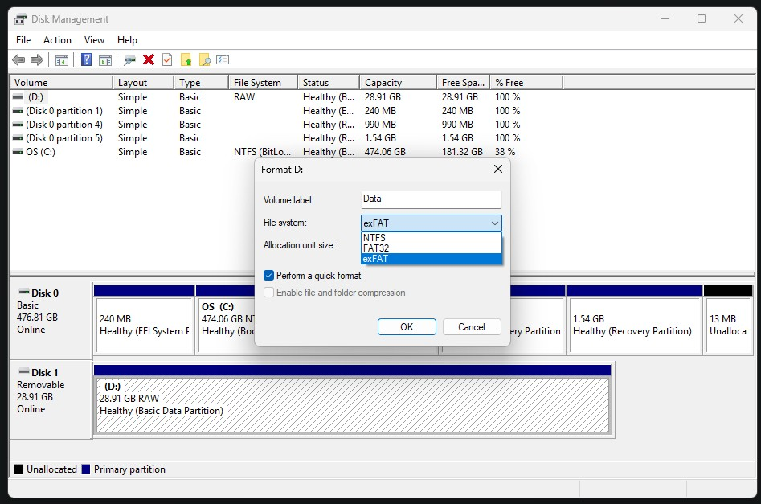

To move on. I chose `exFAT` for the file system on this volume. But, choose what
will suite your needs. Once you're satesfied with the `Volume label` and if
you're OK with using quick format. Click the `OK` button.

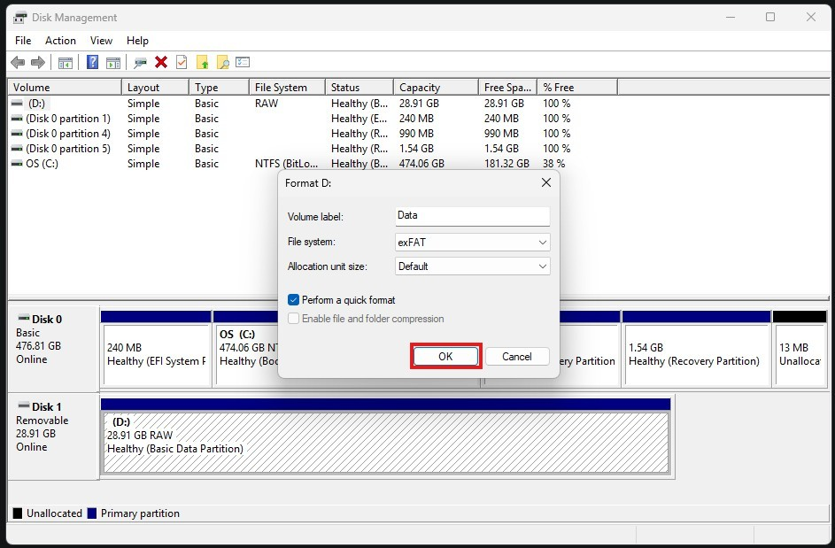

A warning will pop up telling you that this will overwrite your volume. One of
those double-check moments is a good idea. You never know. There may be data on
the disk that you didn't know you needed. If everything is good. Go ahead and
click `OK`.

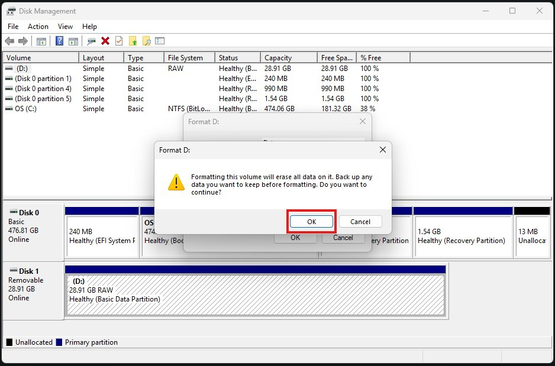

Once this is complete. We should be back at `Disk Management`. It will show us
the freshly formatted drive as the file system you chose. In my case it's
`exFAT`. It will also show the volume name, size, and health status of the
partitions on the disk.

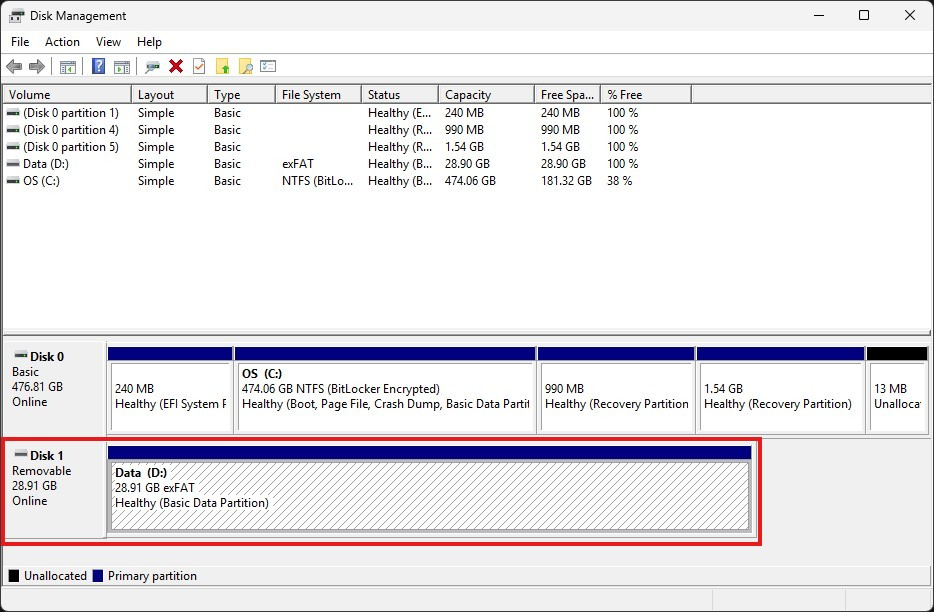

## Conclusion

I went on a little bit of a rant in the summary. But, this note is intended to
show others how to access Windows Disk Management, create a new volume on a hard
drive/flash drive, and format that hard drive/flash drive.

If anyone has any questions related to this note. Please let me know. I should
be available via the [Contact](/contact) page. I hope everyone has a well
deserved and alert free weekend!
