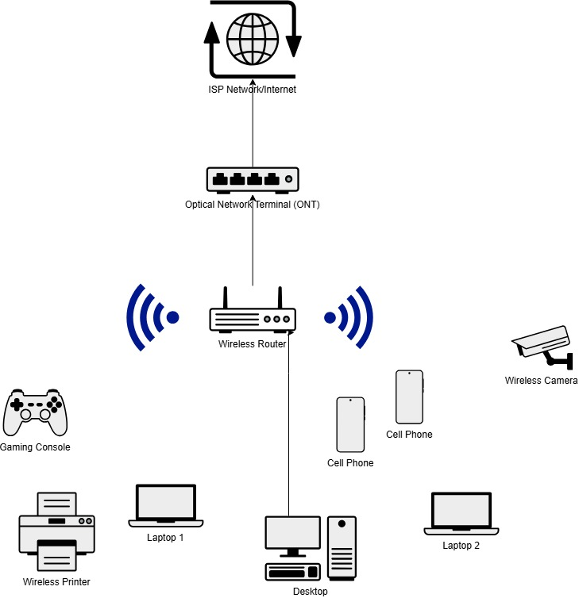

## Summary
---

I've been wanting to start something like this for a while. But, I didn't know
where to begin. The simplest setup seems like a good start.

There will be explaination from my own personal experience related to how a
basic home network is generally setup.

This setup is common in residential or home network setups. Similar setups can
be found in small businesses as well. But, I'll touch on that another time.

These setups are good for those who are OK with the bare minimum or default
configuration.

The overall configuration can be summarized as follows. Justifications and
explainations will be provided in different sections.

- Internet Service Provider that provides fiber to their customers.
- Reviewing speeds that can be avialble to the customer.
- CPE for the network.
- Network layout.
- Network Topology.
- What the client intends to do on the network.
- Subnets used on the network.
- What services are provided on the network.

First I'll provide the scenario, then the design, a walk through of
those design descisions, and finally a walkthrough of how those design decisions
will come to life. Not to mention the level of effort is needed for the end user
and the vendor.

## Scenario
---

In this scenario the client lives in a mid sized house and doesn't care much for
customizing their network. There may be a few bedrooms, bathrooms,living room,
basement, etc.

The customer has a wife and four kids that could be streaming, gaming, doing
school work, shopping online, checking bank statements, working from home,
listening to music, etc.

They have a couple of SMART TVs, cell phones, tablets, laptops, and gaming 
consoles. IoT devices like IoT power strips, a home assistants, a Nest
thermostat and IoT light bulbs. The list goes on and on.

Since there is family in the area. There is a possibility guests will come and
need to use the services provided.

## Summary of Design
---

Provided is a summary of the design in a manner that's to the point.

Customer chosen service provider that provides fiber.

Choses the package they need for available bandwidth.

Customer premise equiptment is provided by the service provider.

- ONT (For fiber connection)
- Wireless Router (For Internet connection)

Customer goes with the default subnet on the router.

- Subnet Possibility 1: 192.168.0.0/24
- Subnet Possibility 2: 192.168.1.0/24

Wireless networking:

Same SSID for both 2.4 and 5 GHz frequencies.

- 2.4G
  - For devices that don't support 5 GHz. i.g. IoT devices
  - Used by a device that prefers it.
- 5G
  - All other devices that support 5GHz

Wireless standards that could be supported or need to be supported.

- 802.11be (Wi-Fi 7) - Maybe
- 802.11xe (Wi-Fi 6)
- 802.11a
- 802.11b
- 802.11g
- 802.11n
- 802.11ac

WPA2 Personal might be configured for authentication to the SSID.

DHCP server is configured to provide IP addresses to devices that connect to the
network.

Gateway uses NAT for the IPv4 connectivity. Gateway has a public IP address
assigned to it from the service provider from DHCP.

## Network Design
---

This may be a little redundant. But, this is the overall design here. Can be
used for future reference.

### Stakeholder Requirements

For these requirements the stakeholder doesn't need anything special. They just
need sufficient wireless perfromance throughout their home. Depending on where
the router is.

The network needs to be able to support multiple devices. This is just random
list of devices you commonly see in some homes.

- Desktop Computers: 1
- Cell Phones: 3
- TVs: 1
- Gaming Consoles: 2
- Laptops: 3
- IoT Light Bulbs: 5
- Ring Cameras: 2
- Wireless Cameras: 4
- Printers: 1

They can connect their desktop computer, TV, or gaming console to the wireless 
router. This of course is optional. But, there are times where stakeholders
would like to have this.

### WAN Options & Internet Access

Internet access will be a NATed network allowing traffic outbound and dropping
inbound traffic unless port forwarding rules are created for gaming. 

### Physical Topology

Although I haven't provided every device for the physical topology. I think we
can all get the jist with this. There is an Optical Network Terminal (ONT)
connected to the ISP network using fiber as a medium. Which provides Internet 
access.

The router connects the end devices using either wireless or wired connections
to the Internet via a copper cabling through the ONT. This will provide just
about everything needed to the network.

### Logical Design

Below is a list of the subnet that will be used for this scenario. Which is
pretty simple. This sticks to the defaults for most wireless routers that get
installed in homes.

- Network: 192.168.0.0/24
    - Network Address: 192.168.0.0
    - Subnet Mask (CIDR): 255.255.255.0 (/24)
    - End (Broadcast) Address: 192.168.0.255
    - Gateway: 192.168.0.1
    - Available Address Range: 192.168.0.1 - 192.168.0.254
    - Addresses: 256
    - Available Addresses: 254

### Logical Topology

### Device Details

### Access Details

In order to access the network. Devices will either need to connect to one of
the physical ports on the router or the wireless SSID it broadcasts.

Wireless SSID(s) will be set with a PSK. Both of which users will need to know
before they can connect.

### Security Measures

Network Address Translation (NAT): 

NAT is configured on the router so connections are going out one IP address. 
This has a layer of protection just because the outside world will have a 
difficult time accessing the internal network.

Wireless Security: 

Wireless security is generally configured using WPA2 Personal with a PSK as long
as the client doesn't just get rid of it. This will prevent unauthorized access
to your network from the wireless network.

## Implementation
---

### Internet Service Provider

The service provider chosen depends on the markets available to the consumer. 
But, in this case we're willing to pay for fiber to the home. So the customer
shops around for options in their area.

Depending on the provider, bandwidth may vary. They could be the following.

Bi-directional bandwidth: (Download/Upload is advertised as the same.)

This can be read by Download/Upload bandwidth as advertised.

- 100 Mbps / 100 Mbps
- 300 Mbps / 300 Mbps
- 500 Mbps / 500 Mbps
- 1 Gbps / 1 Gbps
- 2.3 Gbps / 2.3 Gbps

Non Bi-Directional Bandwidth: (Where the Download/Upload is different. Download
is usually higher then the upload)

- 300 Mbps / 30 Mbps
- 500 Mbps / 30 Mbps
- 1 Gbps / 30 Mbps

After consideration of the options. You might go with the 500 / 500 speeds. Can
also go with 300 / 300 if you just intend to surf the web and occationally watch
streaming services. This option can also be chosen if it's in your budget.

The 500/500 is generally a good option because it's probably more then you need.
But, in the even that you're hosting multiple guests at your house. The
bandwidth can probably take the hit.

So in this case. The 500 / 500 option is chosen. It's a good starting point and
the price option is affordable. Plus there is justification 

Chosen option:

- 500 Mbps / 500 Mbps

### Customer Premise Equiptment (CPE)

In this network it could be done in a few ways. The gear could range from any
vendor the service provider supports/installs.

There are different vendors that the ISP will install. One common vendor could
be Calix.

The CPE equiptment may be as follows.

- ONT
- Wireless router (Unless a different one is purchased)

Connection generally looks like the following with a configuration like this.

ISP network -> ONT -> wireless router WAN/Internet port

### Subnetting

The subnet is probably shared between the wired and wireless network. Below are
usually the default classful ranges associated with this setup.

- Subnet Possibility 1: 192.168.0.0/24
- Subnet Possibility 2: 192.168.1.0/24

Depending on what is set. I'll usually see the following for the subnet. I'll
choose Subnet Possibilty 1 as an example.

- Network: 192.168.0.0/24
  - Network Address: 192.168.0.0
  - Broadcast Address: 192.168.0.255
  - Subnet Mask (/24): 255.255.255.0 (/24)
  - Number of Addresses: 256
  - Usable Addresses: 254
  - Gateway: 192.168.0.1

### IP Addressing

Some IP addresses that will be set.

- Router: 192.168.0.1
  - Routers static route to the Internet will come from the service providers
    DHCP server.

Common DHCP scope and configuration setup on the router.

- DCHP Scope:
  - Range: 192.168.0.10 - 192.168.0.250
  - Gateway: 192.168.0.1
  - DNS: Set to ISP DNS.

### Wireless Configuration

Normally in this case the involvement for the user is setting the SSID name and
the wireless password. This can be setup with the assistance of the ISP
technician during the install. But, 

- SSID: Pretty Fly For A Wifi
  - Password: Chosen by customer.
  - Both 5G and 2.4G can have the same SSID. Customer can also opt into separate
    SSIDs for the different frequencies.

As far as channel selection. The customer shouldn't see that. I've seen with
newer router models where they will just check the wireless environment around
them and select the best channel to use based on what it determines as 
the best one. It's called automatic channel selection. This is intended to
prevent co-channel interferance. It's not always the greatest. But, it has its 
usecase. FortiAPs for example have a hard time with it. I've seen APs within
the same network on the same channel.

### Device Connectivity

All devices will be on the same network. Depending on what is supported by the
device. It will connect to either the 2.4G wireless or the 5G wireless.

Ethernet connectivity to devices will be dependent to how close they are to
where the router was installed.

### Internet Installation

Technician will run the fiber to the home from either the pedistal or the
overhead run that's available. Just depends on where that is. It may even
require some boring.

This fiber will be housed within an enclosure that uses a bulkhead that mates
two SC/APC cables together. This will run through the walls of the home to the
ONT inside. Which may either be mounted on the wall or the like.

Generally they will check the light levels for this to confirm everything looks
good.

Ethernet cable will be connected to the port provisioned for the customer to the
WAN or Internet interface on the router.

Sometimes the technician will help you or walk you through setting up your
wirelss network and confirm everything is working as expected.

## Conclusion
---

Hopefully this provided some explaination for some of the basics related to a
simple intalled as is fiber to the home network design. In a longer format this
kind of goes into the ins and outs of what a simple network design looks like
for fiber to the home customers. I'll do some more research and post some fiber
to the business simplified installs at some point.

This is really just for perspective. ISPs provide a different solution depending
on user needs and what they're willing to purchase.

I'll also create one for cable providers as well. The change with that is
normally the medium being used. Which will be explained in that post.
