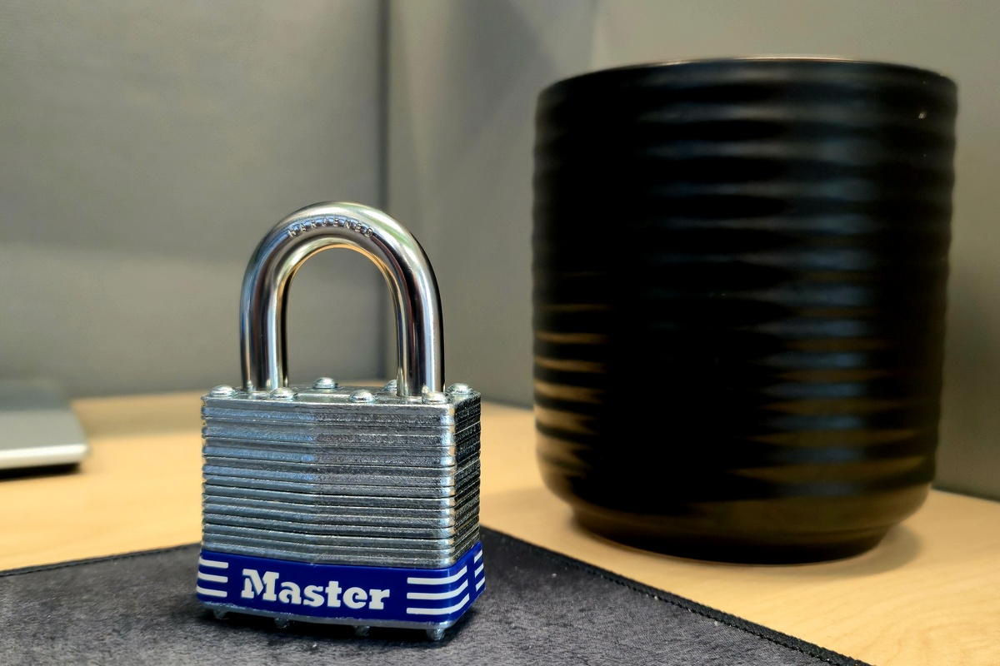

> Notes on this lock are not complete. But, by all means read away!

## Summary
---

Now to start with the lock that broke me into this hobby of lock picking. I
thought I would pick up a `Master Lock No. 1` brand new for the purposes of
adding some of the more common locks to this collection. Mostly because I don't
have keys to the other `Master Lock No. 1` padlock I have. One thing I will say
is there is a difference between a padlock that is new in the packaging and one
I've let sit in the garage for a few years.

> I may not gut/disassemble this padlock until I've reached the point where I'm
> ready for it. Performing a gutting on the `Master Lock No. 1` will require
> removal of the rivet heads. Which I don't have tools for just yet.

So this note is about the `Master Lock No. 1` padlock. Discussing the lock
itself. Some history, specifications, where to find it, who and where it may be
used, etc. Although adding this to the lock notes seems trivial and boring. I
personally haven't looked into it's history. Which given that Master Lock is a
household name. I'll probably delve a little further into it's history. It's the
least I could do for what is considered to be the most common low security
padlock used in the United States.

These notes wouldn't be very enjoyable if I couldn't discuss the vulnerabilities
of this lock. Which I will provide my findings after various tests upon
completion discussing them. Either in video and/or photo format. I intend to buy
more of this model with the intention of performing different destructive tests.
There are multiple posts everywhere of people finding different ways to break
into these that it's almost boring.

I have been reluctant to make a post about this without taking time to
understand it a little more. Just because it's a lock used by many and has been
abused by many. However, there are those who are getting their start in lock
picking and this just may be the post for them where they can learn the
different vulnerabilties and try those for themselves. Keep to the why of these
notes.

## Master Lock No. 1
---

The `Master Lock No. 1` is a laminated steel pin tumbler padlock. These locks
are sold with a hardened steel shackle attached with dual locking ball bearings
intended to prevent pry resistance. With a four-pin cylinder intended for pick
prevension. It's also weather resistant

This is one of Master Lock's most affordable options for those wishing to use
them for personal reasons like picking. They are easy. Though some do struggle
with it. 

### History:
---

Still researching. Will provide updates when the research is complete.

### Intended Use:
---

Master Lock's intended use of the `Master Lock No. 1` is industrial, storefront,
and business gates. Security gates and fences. Along with tool cribs and vending
machines. 

This padlock can be used just about everywhere the shackle fits on to prevent
opening whatever container or fenced area that needs to be secured. The `Master
Lock No. 1` will generally keep out some of the curious people. Along with the
common individual if they never intend on breaking the lock.

### Materials Used:
---

Some of the core materials used in the `Master Lock No. 1` is Alloy Steel with a
laminated finish in the lock body. With a hardened steel shackle.

- **Lock Body:** Alloy Steel
- **Lock Shackle:** Alloy Steel

These locks are susceptible to physical attacks. Which will be covered in a 
future section.

### Dimensions:
---

Here are the dimensions of the lock I purchased. Provided by the vendor either
on the packaging or from the Master Lock website. I may not provide every sizing
option. But, I will definately provide the one(s) of the locks I have.

- **Lock Body (Width):** 1-3/4 in. (44 mm.)
- **Shackle (Length):** 15/16 in. (24 mm.)
- **Shackle (Width):** 3/4 in. (19 mm.)
- Shackle (Diameter):** 5/16 in. (8 mm.)

### Buying Options:
---

The lock that I bought from the hardware store has the `15/16 in.` (`24mm`)
shackle length. In the `Keyed Different (D)` option. But, Master Lock does sell
it in multiple options.

**Shackle Length(s):**

- 15/16in (24mm)
- 2in (51mm)
- 2-1/2in (64mm)

**Keying Option(s):**

- Keyed Different[^1]

On the Master Lock website they market in 1 or 3 quantity packs with a link to
go to one of their partners. I believe buyers can also purchase by a carton with
a quantity of 24 and a shelf pack of quantity of 4.

[^1]: Key Different generally means a different keys are cut for each lock. This
    can be shown by the letter shown after the model of lock. Mine had the
    letter `D` to show this.

### Features:
---

Below are some of the key features Master Lock discusses related to the `Master
Lock No. 1`. Take the features with a grain of salt. Considering that "pick
resistance" in this case means "no resistance". Master Lock is marketing what
they intend for the security features this lock provides.

- 1-3/4in (44mm) Wide laminated steel body for superior strength.
- Hardened steel shackle for extra cut resistance.
- Dual ball bearing locking for maximum pry resistance.
- 4-pin cylinder for added pick resistance.
- Weather resistant and rugged.
- Three different sizing options to choose from. (Included in [Buying Options](#buying-options))

## Gutting The Master Lock No. 1
---

I have not gutted this lock given that the rivets don't provide the ability to
do so. But, in the future I intend to take it apart and display gutting the lock.
When I do this I'll be adding pictures and a video to these notes.

## Where To Find These Locks
---

The `Master Lock No. 1` can be found in just about any Home Depot or Lowes I
think. I've also seen these in Ace hardware store, Walmart, Menards, etc. I
haven't reviewed much else. But, those are the places I would go within the
midwest. This is a pretty common padlock. So, you may be able to ask a relative
for one to keep if they're feeling generous as well.

## Who May Be Using These Locks?
---

Given how common the `Master Lock No. 1` is. I would say its use can be found
being used anywhere from your school or gym teacher, construction sites, storage
units, tool chests, sometimes even bike chains. I've even seen these locks used
to lock up electrical boxes and traffic cameras. Just depends on who wants to
use it. Sometimes people just need a temporary solution to lock up their
belongings. Even though I advise against using this model. Sometimes this is the
only option someone has or knows of.

## Lock Pickers United Rating (White belt)
---

Now it's time to discuss this in relation to the lock sport community. Using 
the [LPU Belt Explorer](https://lpubelts.com/) this lock is sitting in the
`White belt` category. So, to their standards these locks are good for beginners.

The requirement for this to pick this lock with any tool. I think this applies
to bypass methods as well. The evidence format for this belt is video or photos
showing the turned core.

When I reviewed the lock it provides older pictures of it gutted and presents
some information about the standard pins. Along with other parts of the lock.
It's safe to say that this lock is well documented within this community.

## Vulnerabilities
---

This is where I move to the section of these notes that I find the most fun.
I will be experimenting with multiple attacks and I will post the ones that
worked. There is a large number of attacks that can be performed on the `Master
Lock No. 1`. Just need to pick one[^2].

[^2]: I will note that these are tests intended to inform the general public of
    the locks security. There have been lock companies and lock smiths that
    would prefer for these vulnerabilities to remain trade secrets. Which is the
    exact opposite of what a lock company or lock smith should be doing. The
    competative market should be rewarding lock companies for providing
    affordable yet secure locks. Not affordable yet insecure locks. On the other
    side of that coin. I do not condone the attempt of these vulnerabilities on
    a lock you're either using or don't own. As Bosnian Bill would say, "Stay
    safe and stay legal."

Included in these attacks I will be providing the tools I use to exploit the
vulnerabilities on the `Master Lock No. 1`. If you prefer another tool for the
job and want to discuss it. Please send me a message or an email; information
can be found on the [Contact](/contact) page of this site. I'd be happy to
discuss.

### Picking Attacks
---

#### Raking
---

#### Single-Pin Picking
---

## Conclusions & Opinions
---

