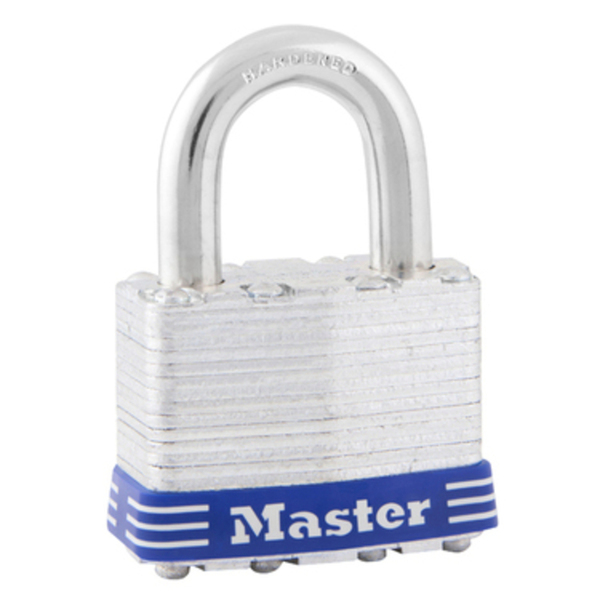

## Summary
---

## Master Lock No. 1
---

Now on to the actual lock. The Master Lock No. 1 is marketed as a `1-3/4in
(44mm) wide laminated steel pin tumbler padlock intended for Outdoor Storage, 
Fences, Self-Storage Unites, Lockers, Tool boxes, Job boxes, and Gang boxes. Not 
to mention it's weather resistant given that it's laminated steel.

  

> Image was downloaded from Master Lock's website.
 
The lock that I bought from the hardware store has the `15/16in` (`24mm`)
shackle length. In the `Keyed Different (D)` option. But, Master Lock does sell
it in multiple options. Which I will list below.

**Shackle Length(s):**

- 15/16in (24mm)
- 2in (51mm)
- 2-1/2in (64mm)

**Keying Option(s):**

- Keyed Different

On the Master Lock website they market in 1 or 3 quantity packs with a link to
go to one of their partners.

**Features:**

- 1-3/4in (44mm) Wide laminated steel body for superior strength.
- Hardened steel shackle for extra cut resistance.
- Dual ball bearing locking for maximum pry resistance.
- 4-pin cylinder for added pick resistance.
- A Limited Lifetime Warranty.

**Dimmensions:**

- **Body Width:** 1-3/4 in (44 mm)
- **Shackle Length:** 15/16 in (24 mm)
- **Shackle Width:** 3/4 in (19 mm)
- **Shackle Diameter:** 5/16 in (8 mm)

## Gutting The Master Lock No. 1
---

## Where To Find These Locks
---

## Who May Be Using These Locks?
---

## Lock Pickers United Rating (White belt)
---

Now it's time to discuss this in relation to the lock sport community. Using 
the [LPU Belt Explorer](https://lpubelts.com/) this lock is sitting in the
`White belt` category. So, to their standards these locks are good for beginners.

The requirement for this to pick this lock with any tool. I think this applies
to bypass methods as well. The evidence format for this belt is video or photos
showing the turned core.

When I reviewed the lock it provides older pictures of it gutted and presents
some information about the standard pins. Along with other parts of the lock.
It's safe to say that this lock is well documented within this community.

## Conclusions & Opinions
---

