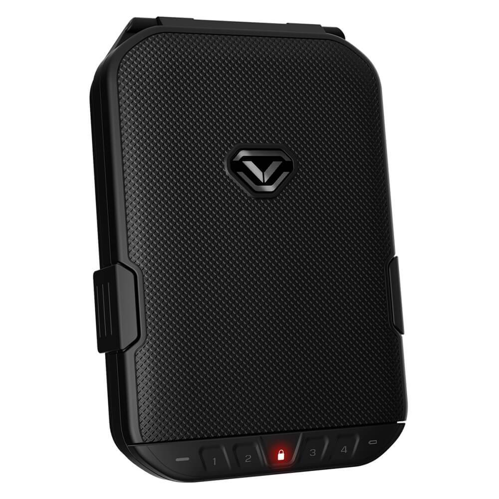

## Summary

I have a Vaultek LifePod 1.0 (VLP10-BK) safe I bought a few years ago to store 
valuables or keep firearms away from children. Not to mention keep away from 
those who may attempt to steal the firearm or use it for other reasons. I like 
to be careful with things that could be potentially dangerous towards life and 
limb.

Well, one day I decided to roll the PIN for the safe for security reasons. But,
after I set the PIN. I got to running a few errands and guess what. Dumbass (me)
forgot the PIN. So, it's been sitting with pick protection turned on so not even
the key works on it.

Multiple failed attempts to gain access the safe using other methods. Such as
attempting to pry it open, use the lock picking lawyers bypass method, etc. off
and on throughout the span of a few years failed. Until recently I thought, Why
don't I just generate a list of possible PINs and try that.

I wouldn't say I cracked it cracked it. More so had the patience to brute force
the PIN until I was able to get in. The Lock Picking Lawyers method didn't work
for reasons I'll explain later. But, I'm sure if not for that detail. It
probably would have worked.

## Vaultek LifePod 1.0 (VLP10-BK)

Vaultek designed the LifePod 1.0 as a portable secure case designed for handguns, 
travel, and outdoor use. It can hold any number of items including your
passports, jewelry, wallet, keys, and full-sized semi-automatic pistols. 



### Dimensions & Weight

Dimensions and weight are as follows:

- Exterior Dimensions: 10.25" H x 7" W x 2.25" W 
- Interior Dimensions: 7.75" H x 6" W x 1.75" W
- Weight: 2.3 lb

### Features

Listed are some of the features of the Vaultek LifePod 1.0:

- Built-in reinforced anti-impact latch lock with anti-picking feature.
- TSA guideline compliance for flying with handguns.
- Smart Sense backlit keypad with digits 1 through 4.
- Two manual backup keys.
- Airtight dust-proof seal with dual side compression latches. 
- Powered using a 9V battery. (Not included in packaging)
- Can be powered via a micro USB.
- Four minute lockout time period for a number of 6 failed PIN attempts.
- Maximum 8 digit PIN with a minimum of 4 digits.

### Accessories

This product comes with a few accessories in box.

- 19" steel security cable.
- Fabric lanyard.
- High-density foam interior.

> Although I do own one of these. I am not endorsing this product with this note.
> I am providing my thoughts on this product on the grounds of educating others
> on observations I've had while using the product. To provide a clearer picture
> of its features strengths and weaknesses.

## Using The Key

I attempted to utilize the key to access the safe. But, turning on the
anti-picking feature prevents the key from being used on the safe. Which makes a
lot of sense.

I guess it's safe to say the anti-picking feature works well. The anti-picking
feature disables the key hole preventing it from being turned or used to unlock
the case.

## Prying Open The Vaultek LifePod 1.0

I wouldn't recommend this. I tried to do this by hand and considered using a
hand saw to cut through the hinges. Crow bar attempts failed to break the lock.
Either due to skill issues, concerns of personal safety, or not having the
proper tools. There was a gun in the safe after all. So I scratched some of the
ideas I had off the list. Eventually I threw in the towel with this option and
moved on to other methods. Cave man method didn't work out. I will admit that it
wasn't one of my brighter ideas anyway.

## Lock Picking Lawyer: Opening Vaultek LifePod Gun Safe With Fork

The Lock Picking Lawyer has great content on YouTube. I've learned much about
lock picking from his videos. Stuff that I didn't think of. I personally believe
his videos have been valuable education related to what locks to consider. He
discusses gun safes like the Vaultek LifePod in his videos too. One of which 
includes this safe. Which upon finding he could open it using a fork. I had 
mixed feelings. For one I was filled with hope that I would be able to get into 
it. On the other hand. I thought to myself, Shit. I'm going to need to get a 
different safe.

I attempted the same method for probably an hour before I gave up and discovered
the mag-well was blocking my trusty silverware side-kick access to the reset
button. Which is something to consider. What you place and how you place items
in the safe can determine how difficult it can be to exploit this vulnerability.



Here is a QR code for the video if you need to run and want to watch it on your
phone. I'd recommend watching it to the end if interested.


https://www.youtube.com/watch?v=T5YsZLJ5FjY


I will have to come back to this down the road to make the attempt when I'm in
just to see how it works. Then I'd like to try different methods and report as I
go along. A fork may not work depending on the placement in the safe. But, maybe
a paperclip will.

## Cracking The Vaultek LifePod 1.0 PIN

I will say out of the gate. The method that worked was brute forcing the PIN.
But, I would like to discuss how I got there, explain some of the math, and
how to generate a list of PINs so someone else can potentially get back into
their safe.

If no one wishes to generate either list of PINs I'm about to go over. ChatGPT
will generate both for you if the right prompt is used. Something to bear in
mind if you cannot run the code or don't have the desire to.

```txt
Generate a list of possible PIN combinations for a 4 digit PIN where numbers 
aren't repeated and the only digit options in the PIN are 1 through 4.
```

Once it provides its answer ChatGPT can be asked something like this to get the
list of PINs where digits can be repeated.

```txt
Now generate a similar list. But, digits can repeat.
```

I will not provide a list of PINs. But, I will provide code that can help you
generate these lists yourself. This will be divided into two sections. One for
the list of PINs for numbers that don't repeat. The other list of PINs with
numbers that do repeat.

There is some information circulating that setting an 8 digit PIN is possible.
However, I have not seen this to be the case with the Vaultek LifePod 1.0 model.
From what I've seen is only a 4 digit PIN can be set.

### With Permutations & Minimum Digits

If the PIN has no repeating numbers it takes less time. Especially when you
consider how little options there are. In this case. If it's entirely unique
where the numbers don't repeat. The odds are in the attackers favor. This is
because of the time factor. Brute forcing the PIN may take time. But, when you
think about it. That's something an attacker can be willing to make for your
passport, firearm, or your firearm.

Time can definitely be a factor that determines an attackers success.
Temperaments are different for just about anyone and sometimes the time spent on
something is more valuable then whatever is in there. That's time lost the
attacker could spend on easier targets.

You can calculate this by multiplying each individual PIN option as a
permutation. If we don't repeat numbers we have `24` possible combinations.
Which makes brute forcing the PIN take less time.

```
4! = 4 X 3 X 2 X 1 = 24
```

Generating this is easy with Python using the `itertools` module. It can easily
accommodate the need to implement permutations and generate the full list of
options to use. 

```python
import itertools

pin_combinations = []
digits = ['1', '2', '3', '4']
pin_len = 4

perms = itertools.permutations(digits, pin_len)

for option in perms:
    pin_combinations.append(''.join(option))

for pin in pin_combinations:
    print (pin)

print (f"\nTotal combinations: {len(pin_combinations)}")
```

I will provide a little output from running this script. There are some PIN
combinations with the total number of combinations.

```sh
1234
1243
1324
1342
...
2134
2143
2314
...
4312
4321
Total combinations: 24
```

### With Repetitions Minimum Digits

Now to discuss PIN options where repetitions are possible. Believe it or not. It
actually takes longer with this one. If you were to start from beginning to end
you would be typing in `256` possible combinations with a `4 minute` lockout
period after 6 failed attempts. 

To get this number we calculate 4 to the power of 4. When said and done. The
math shows `256` possible combinations.

4<sup>4</sup> = 256

I look again to the `itertools` library to help me with this one. Only this time
I use the `product` module to generate the combinations with repeating numbers.

```python
import itertools

pin_combinations = []
digits = ['1', '2', '3', '4']
pin_len = 4

perms = itertools.product(digits, repeat=pin_len)

for option in perms:
    pin_combinations.append(''.join(option))

for pin in pin_combinations:
    print (pin)

print (f"Total combinations: {len(pin_combinations)}")
```

Here is some of the output from this script.

```sh
1111
1112
1113
1114
1121
1122
1123
1124
1131
1132
1133
1134
1141
1142
1143
...
4341
4342
4343
4344
4411
4412
4413
4414
4421
4422
4423
4424
4431
4432
4433
4434
4441
4442
4443
4444
Total combinations: 256
```

### With Maximum Digits

While doing some more research into this case. There is a possibility of having
an 8-digit pin. Which really doesn't provide PIN options that don't repeat.
Which considering the previous section. The chances on you narrowing down the
correct PIN are lower when you can repeat numbers. (Mathematically anyway)

When you consider the math it's similar to the previous section also. To get the
total count. We have to get the result of the largest number (4) to the power of
8. This gives us approximately 65,536 possible PIN combinations. Which would
take a longer time to crack then the previous section. 

Something to consider. Not everyone has the mental bandwidth to  remember an 8 
digit PIN. These are meant to store pistols. Which are generally meant for home
defense. With an adrenaline spike from the moment of discovering home intrusion
or a situation that dictates use of a firearm for protection. The juice may not
be worth the squeeze.

4<sup>8</sup> = 65,536

Here is a script written in Python that uses the `itertools.product()` module to
generate all possible 8-digit PINs from the available digits.

```python
import itertools

pin_combinations = []
digits = ['1', '2', '3', '4']
pin_len = 8

perms = itertools.product(digits, repeat=pin_len)

for option in perms:
    pin_combinations.append(''.join(option))

for pin in pin_combinations:
    print (pin)

print (f"Total combinations: {len(pin_combinations)}")
```

Here is the output from this script. I will not provide the full list here
considering its size. There is a considerable list of output providing a total
of `65,536` combinations.

Like I've said previously. The length of time it would take to crack this would
be a nightmare. But, the practicality may not be for everyone. So, perhaps it
makes sense to either stick with the minimum digits with repeated numbers. Maybe
it even makes sense to rest somewhere in the middle.

```sh
...
31111134
31111141
31111142
31111143
31111144
31111211
31111212
31111213
31111214
31111221
31111222
31111223
31111224
31111231
31111232
31111233
31111234
31111241
31111242
31111243
31111244
31111311
31111312
31111313
31111314
31111321
31111322
31111323
31111324
...
44444311
44444312
44444313
44444314
44444321
44444322
44444323
44444324
44444331
44444332
44444333
44444334
44444341
44444342
44444343
44444344
44444411
44444412
44444413
44444414
44444421
44444422
44444423
44444424
44444431
44444432
44444433
44444434
44444441
44444442
44444443
44444444
Total combinations: 65536
```

### Brute Forcing The PIN

Brute forcing the PIN number is what re-gained me access to this case. With a
little time an patience it I was able to reclaim my valuables, reset the PIN,
and go about my day. If I would recommend it to anyone else I would say to set a
PIN with repeating numbers or go up and use an 8 digit PIN instead of a 4 digit
PIN. Be mindful of the repeated numbers also. Don't make it obvious.

## Conclusion

Everything I've done in an attempt to break into the Vaultek LifePod 1.0
(VLP10-BK) is in this write-up. The failed attempts with the successful one. This
is purely educational and I don't recommend some of the failed methodologies so
you don't void your warranty.

I provided some details on the specifications, features, etc. on the LifePod
1.0. With multiple failed attempts to get back into it. I finally did by brute
forcing the 4 digit PIN on the device. Which allowed me to access and reclaim
what was inside. I would personally recommend Sung a PIN that doesn't have
repeating digits.

I'll update some notes in the future on the Lock Picking Lawyer fork unlocking
method sometime. I'll update the note with my findings when I've done that.

After looking into the Vaultek LifePod 1.0 (VLP10-BK). I'm considering other
options. Although this may be a good case to store valuables to keep out of the
hands of small children. It's not the best option for keeping firearms or other
valuables out of the hands of someone who steals it. There is also the
vulnerability associated with the reset button. Rendering the 8-digit PIN
useless is someone were to exploit it. As I understand it. This has been fixed
in newer models. Where their answer was to disable the reset button for the case
while it's closed. Which is an effective solution. I believe this is fixed in
the Vaultek LifePod 2.0.
